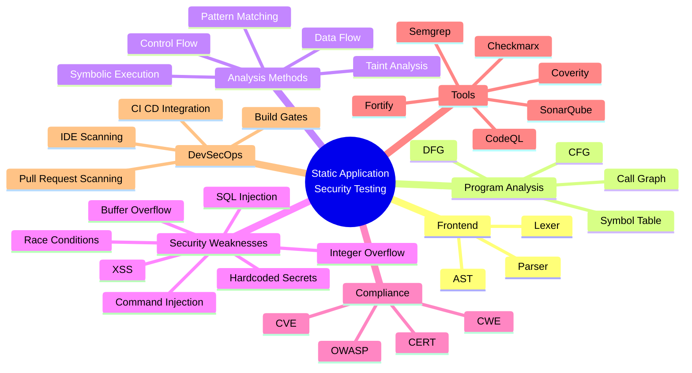
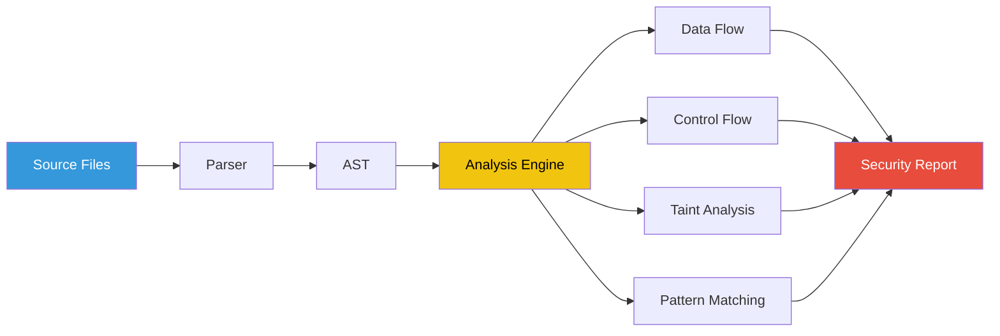

# **`Awesome`** Static Application Security Testing ([SAST](https://wikipedia.org/wiki/Static_application_security_testing)) 

    
    &nbsp;
    
    &nbsp;
    
    

## 📖 Contents
- [My Awesome Lists](#my-awesome-lists)
- [Contributing](#contributing)
- [Contributors](#contributors)

---
---

- [Opengrep](https://github.com/opengrep/opengrep) - Static code analysis engine to find security issues in code.
- [Semgrep](https://github.com/semgrep/semgrep) - Lightweight static analysis for many languages. Find bug variants with patterns that look like source code.

##

### My Awesome Lists
You can access the my awesome lists [here](https://cyberthreatdefence.com/my_awesome_lists)

### Contributing
[Contributions of any kind welcome, just follow the guidelines](contributing.md)!

### Contributors
[Thanks goes to these contributors](https://github.com/cybersecurity-dev/awesome-sast/graphs/contributors)!

### License

[🔼 Back to top](#awesome-static-application-security-testing-sast-)
