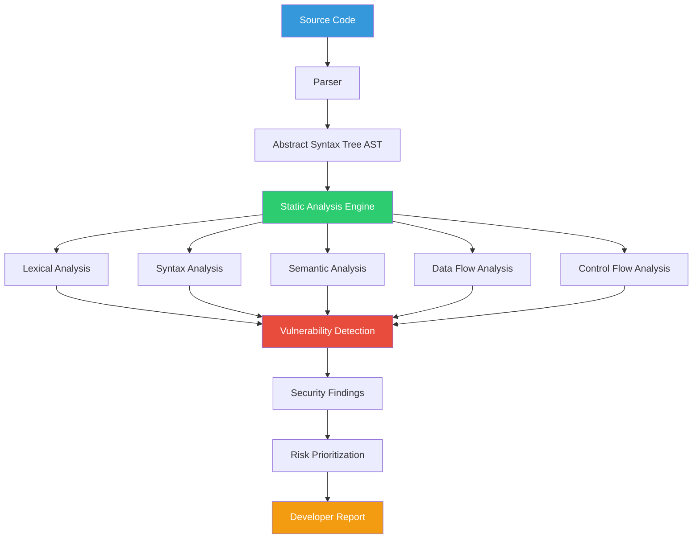

# SAST Analysis Pipeline

```mermaid
flowchart TD

A[Source Code]

--> B[Parser]

--> C[Abstract Syntax Tree AST]

--> D[Static Analysis Engine]

D --> E[Lexical Analysis]
D --> F[Syntax Analysis]
D --> G[Semantic Analysis]
D --> H[Data Flow Analysis]
D --> I[Control Flow Analysis]

E --> J[Vulnerability Detection]
F --> J
G --> J
H --> J
I --> J

J --> K[Security Findings]

K --> L[Risk Prioritization]

L --> M[Developer Report]

style A fill:#3498db,color:#fff
style D fill:#2ecc71,color:#fff
style J fill:#e74c3c,color:#fff
style M fill:#f39c12,color:#fff
```
